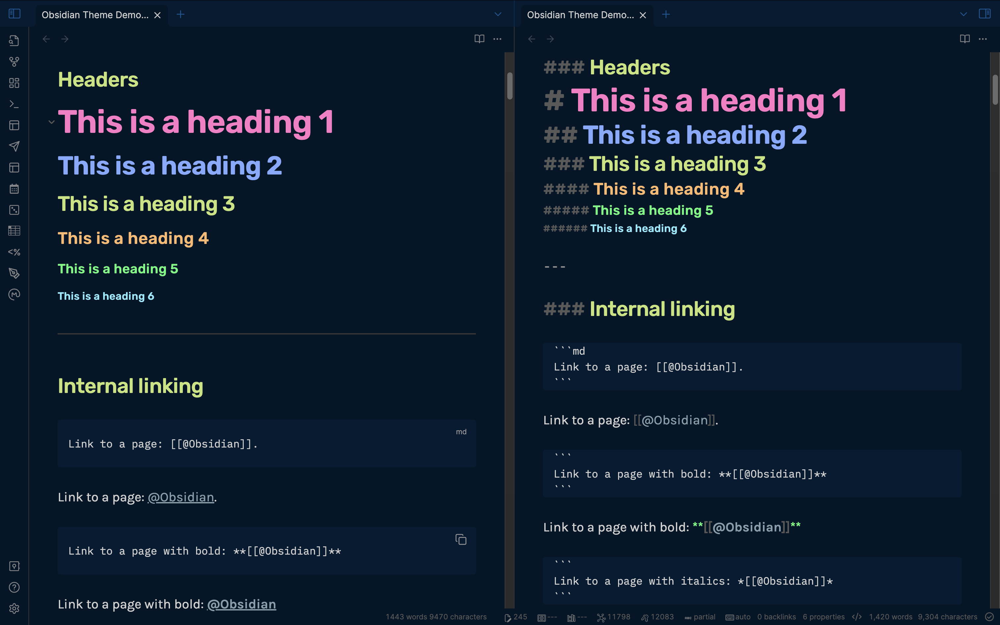

# Obsidian.md - Night Owl Theme

⚡ Inspired by the original [Night Owl theme](https://github.com/sdras/night-owl-vscode-theme) by [Sarah Drasner](https://twitter.com/sarah_edo).

## 📥 Installation

### Obsidian Marketplace (Recommended)

1. Open the **Settings** in Obsidian
1. Navigate to **Appearances** tab under **Options**
1. Under the **Themes** section, click on the `Browse` button next to **Community Themes**
1. Search for `Night Owl` in the Filter text input in the upper left corner
1. Click `Use` and then you're done! 🎉

### Manual

1. Download this repo
1. Copy the `obsidian.css` file into your vault's `/.obsidian/themes` directory
1. Rename the file to `Night Owl.css` so it will have a unique name in the theme selection dropdown
1. Open the **Settings** in Obsidian
1. Navigate to **Appearances** tab under **Options**
1. Under the **Themes** section, click on the dropdown menu next to **Theme** heading
1. Select for `Night Owl` and then you're done! 🎉

## FAQs

### How do I customize this theme?

#### Easiest: Use [Obsidian Style Settings Plugin](https://github.com/mgmeyers/obsidian-style-settings)

This allows you to configure the theme directly in Obsidian without any CSS knowledge required!

More settings to come, but if you have specific requests, please [open an issue here](https://github.com/bencodezen/obsidian-night-owl-theme/issues/new)!

#### Intermediate: Add CSS snippets

Check out CSS snippets as a way to progressively enhance the theme.

Here's a [useful forum post](https://forum.obsidian.md/t/how-to-achieve-css-code-snippets/8474) to help get you started.

> 🎩 Thanks to the suggestion by @DutchPete!

#### Hard: Create a fork of this theme

This is arguably the most reliable route, but will require some familiarity with coding.

I recommend using [Node.js](https://nodejs.org/en/) so you can leverage the [Sass](https://sass-lang.com/) I'm starting to break out so you can make meaningful changes.

The Sass partials are will a work in progress though, so the way things are organized will probably change over time as I establish out better ways to structure how theming styles should be organized.

## Typography

### Preview Mode

When in preview mode, the typography is inspired by a dual font family system to easily distinguish between headings and regular text.

- Headings: [Rubik](https://fonts.google.com/specimen/Rubik)
- Body: [Karla](https://fonts.google.com/specimen/Karla)

### Editor Mode

When in edit mode, the typography is inspired from a developer like environment where you're "coding" your second-brain.

- [IBM Plex Mono](https://fonts.google.com/specimen/IBM+Plex+Mono)

## Credit

🎩 Hat tip to the [Dracula Obsidian Theme](https://github.com/jarodise/Dracula-for-Obsidian.md) for serving as the base theme I used to create this theme.
